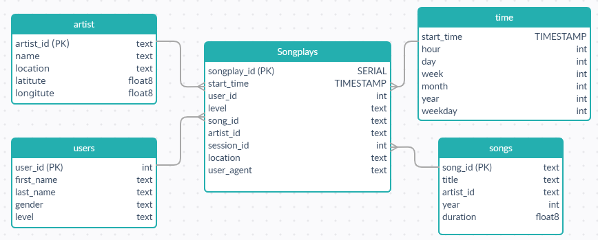

# Project Summary
## Introduction
A startup called Sparkify wants to analyze the data they've been collecting on songs and user activity on their 
new music streaming app. The analytics team is particularly interested in understanding what songs users are listening 
to. Currently, they don't have an easy way to query their data, which resides in a directory of JSON logs on user 
activity on the app, as well as a directory with JSON metadata on the songs in their app.

They'd like a data engineer to create a Postgres database with tables designed to optimize queries on song play 
analysis, and bring you on the project. Your role is to create a database schema and ETL pipeline for this analysis. 
You'll be able to test your database and ETL pipeline by running queries given to you by the analytics team from 
Sparkify and compare your results with their expected results.

## Description
The project includes an ETL pipeline using Python to extract data from `song_data` and `log_data` and load them to 
`sparkifydb` database. And generate a Dashboard for data by executing queries and plotting with `matplotlib` package 
in `dashboard_analytics.ipynb`.

## Database in STAR schema


# How to run Python file
## Step 1: Create sparkifydb and its tables 
Create the `sparkifydb` database and add songplays, artists, users, time, and songs tables into the database.
by running the `create_tables.py`

```
python create_tables.py
```

## Step 2: Run ETL pipeline
Run the ETL pipelines to extracting, transform and load data from JSON files in data/song_data and data/log_data
```
python etl.py
```

## Step 3: Generate Dashboard
Run the `dashboard_analytics.ipynb` Jupyter notebook

# Repository
## `data` folder
The `data` folder includes 2 separate folders, 
* The `song_data` folder includes all JSON files need for `songs` and `artists` tables.
* The `log_data` folder includes all JSON files need for `songplays`, `users`, and `time`
```
├── create_tables.ipynb
├── create_tables.py
├── dashboard_analytics.ipynb
├── etl.py
├── project1_star_schema.PNG
├── README.md
├── sql_queries.py
├── test.ipynb
└── data
    ├── log_data
    │   └── 2018
    │       └── 11
    │           ├── 2018-11-01-events.json
    │           ├── 2018-11-02-events.json
    │           └── ...
    └── song_data
        └── A
            ├── A
            │   ├── A
            │   │   ├── TRAAAAW128F429D538.json
            │   │   ├── TRAAABD128F429CF47.json
            │   │   └── ...
            │   ├── B
            │   │   ├── TRAABCL128F4286650.json
            │   │   ├── TRAABDL12903CAABBA.json
            │   │   └── ...
            │   └── C
            │       ├── TRAACCG128F92E8A55.json
            │       ├── TRAACER128F4290F96.json
            │       └── ...
            └── B
                ├── A
                │   ├── TRABACN128F425B784.json
                │   ├── TRABAFJ128F42AF24E.json
                │   └── ...
                ├── B
                │   ├── TRABBAM128F429D223.json
                │   ├── TRABBBV128F42967D7.json
                │   └── ...
                └── C
                    ├── TRABCAJ12903CDFCC2.json
                    ├── TRABCEC128F426456E.json
                    └── ...
```
